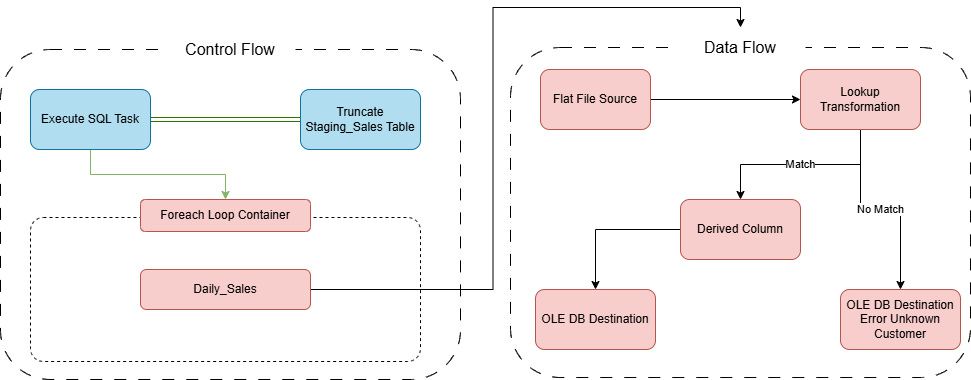

# 🚀 Enterprise Retail Sales ETL Pipeline (SSIS)

An enterprise-grade, end-to-end Data Integration (ETL) pipeline designed to automate daily sales data ingestion from distributed retail branches into a centralized Data Warehouse. Built using **MS SQL Server Integration Services (SSIS)** and **SQL Server Management Studio (SSMS)**, this project adheres to modern data warehousing practices and rigorous data quality tracking.

---

## 📐 Data Pipeline Architecture (Visual Blueprint)

> 💡 **System Architecture Design:** Below is the complete visual design mapping both the orchestration layer (Control Flow) and the ingestion pipeline (Data Flow).



---

## 📌 Business Case Study & Problem Statement
A retail company with multiple branches (`Cairo`, `Alex`, `Aswan`) generates daily transactional sales data in flat file formats (`.csv`). These files are dropped into a shared network directory. 

The pipeline automates:
1. **Dynamic File Ingestion:** Looping through multiple branch files dynamically without hardcoding paths.
2. **Data Cleaning & Type Casting:** Standardizing raw metadata before processing.
3. **Data Integrity (Lookup Validation):** Verifying customer accounts and routing invalid transactions to an audit log.
4. **On-the-Fly Business Metrics:** Dynamically calculating metrics like customer age at the exact time of transaction.

---

## 🛠️ Tech Stack & Tools
* **ETL Engine:** Microsoft SQL Server Integration Services (SSIS)
* **Database Engine:** Microsoft SQL Server (SSMS)
* **Design & Blueprinting:** Draw.io
- **Data Architecture:** Dimensional Modeling (Star Schema)

---

## ⚙️ Technical Implementation Details

### 1️⃣ Control Flow Automation
* **Truncate Staging:** An `Execute SQL Task` ensures idempotency by clearing the staging area before every execution loop.
* **Foreach Loop Container:** Dynamically enumerates all `.csv` files inside the target directory using expressions and assigning the current file path to a variable (`@[User::FilePath]`).

### 2️⃣ Data Flow Transformation Pipeline
* **Flat File Source:** Reads file streams dynamically based on runtime connection configurations.
* **Data Conversion Component:** Handles strict metadata typing by casting textual customer keys into `four-byte signed integer [DT_I4]`.
* **Lookup Validation (Full Cache):** Matches incoming sales data with the master database (`Dim_Customers`).
  * **Match Output:** Proceeds downstream to the core warehouse layer.
  * **No-Match Output:** Dynamically redirected to a fallback auditing table (`Error_Unknown_Customers`).
* **Derived Column Transformation:** Injects real-time business logic using explicit casting and the `DATEDIFF` interval function:
  ```text
  DATEDIFF("yy", (DT_DATE)[Birth_Date], (DT_DATE)[Purchase_Date])
---

## 🗄️ Database Schema & Dimensional Modeling

The project implements a **Star Schema** optimized for downstream analytical queries and BI reports.

### Data Warehouse Tables:

| Table Name | Type | Key Columns | Description |
| :--- | :--- | :--- | :--- |
| **`Dim_Customers`** | Dimension | `Cust_Key` (PK) | Stores master customer profiles and demographics. |
| **`Fact_Sales`** | Fact | `Transaction_ID` (PK), `Cust_Key` (FK) | Captures clean operational sales metrics and calculated values. |
| **`Error_Unknown_Customers`** | Audit / Log | None | Isolates broken or unvalidated records for business intelligence auditing. |

---

## 🚀 How To Run & Test

1. **Clone the repository:**
```bash
   git clone [https://github.com/ziyadshezoo/Enterprise-Sales-ETL-Pipeline-SSIS.git](https://github.com/ziyadshezoo/Enterprise-Sales-ETL-Pipeline-SSIS.git)
